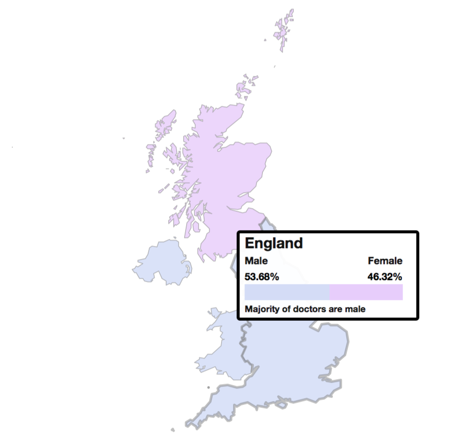

# Women doctors outnumber men for the first time ever*

This is a repository to show how to build a tableau style interactive map for free using RStudio and leaflet. 

## For those fairly new to RStudio 

- Click on the save to .zip file in the top right hand corner

- Unzip the file on your desktop, and then click on the file that says "leaflet-mapping-doctors-uk.Rproj"

- This will open the project, then click open the file "leaflet-mapping-doctors-uk.R"

- Then you'll see a script. It'll contain a lot of libraries. For each of these you will have to install them, by using install.packages("name_of_package") until you've done them all, then you'll be able to run the script and generate the map. 